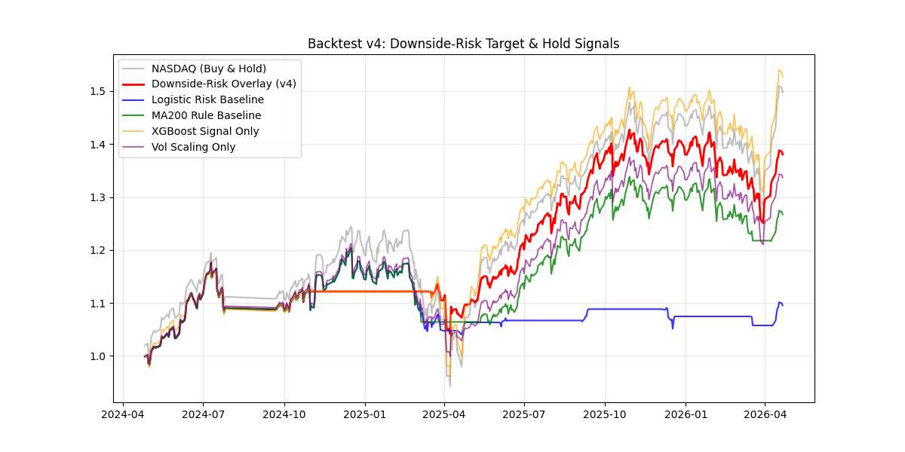

# NASDAQ Downside-Risk Overlay v4
## GitHub Portfolio Summary

**Project Type:** Quant research / risk overlay  
**Primary Reader:** interviewer, quant practitioner, PM reviewer  
**Version:** v4

## What This Project Tries To Do
This project does not try to beat NASDAQ by calling every short-term direction move.

It asks a narrower and more defensible question:
when does downside risk become high enough that equity exposure should be reduced?

The strategy is therefore framed as a **downside-risk overlay**, not a pure alpha engine.

## Core Design
- downside-risk event target over a 20-trading-day horizon
- purged time-series cross-validation with embargo
- rolling z-score treatment for macro-stress features
- class-imbalance handling in XGBoost
- probability calibration layer
- hysteresis-based signal conversion
- volatility scaling for position sizing
- cost sensitivity and stress-window analysis

## Headline v4 Results

| Metric | Value |
| --- | ---: |
| PR-AUC | 0.3267 |
| Brier Score | 0.2508 |
| Log Loss | 1.2853 |
| Accuracy (secondary) | 0.6609 |
| Risk-Event Base Rate | 0.2875 |
| Final Strategy Return | 1.4219 |
| NASDAQ Return | 1.4966 |
| Sharpe Ratio | 1.4480 |
| Max Drawdown | -12.37% |

## Why v4 Matters
The most important change from earlier versions is not higher raw return. It is better research hygiene.

v4 now reflects:
- true forward drawdown labeling rather than a simple future-min shortcut
- next-day execution timing
- fold-local smoothing instead of global smoothing across CV boundaries
- more realistic turnover-aware transaction costs
- probability diagnostics beyond accuracy

That means the result is harder to overstate and easier to defend.

## Benchmark Read
| Strategy | Final Return | Sharpe | MDD | Avg. Exposure | Turnover |
| --- | ---: | ---: | ---: | ---: | ---: |
| XGBoost Risk Model | 1.4219 | 1.4480 | -12.37% | 71.70% | 6.21 |
| Matched Avg Exposure | 1.3528 | 1.1542 | -17.91% | 71.54% | 0.39 |
| Logistic Risk Baseline | 1.1136 | 0.5764 | -13.87% | 42.93% | 9.87 |
| MA200 Rule Baseline | 1.2940 | 1.0447 | -12.06% | 81.06% | 9.58 |

The key comparison is **Matched Avg Exposure**.  
That benchmark carries nearly the same average exposure as the final model, but weaker Sharpe and materially worse drawdown. This helps separate model edge from simple de-risking.

## Attribution Read
| Component | Final Return | Sharpe | MDD | Avg. Exposure | Turnover |
| --- | ---: | ---: | ---: | ---: | ---: |
| Buy & Hold | 1.5063 | 1.1542 | -24.32% | 99.78% | 0.55 |
| Matched Avg Exposure | 1.3528 | 1.1542 | -17.91% | 71.54% | 0.39 |
| XGBoost Signal Only | 1.5805 | 1.4062 | -17.09% | 79.74% | 1.65 |
| Vol Scaling Only | 1.3648 | 1.1307 | -17.58% | 87.99% | 7.24 |
| Final: XGBoost + Vol Scaling | 1.4219 | 1.4480 | -12.37% | 71.70% | 6.21 |

Interpretation:
- signal layer helps with regime selection
- volatility scaling improves drawdown shape
- combined overlay gives the strongest risk-adjusted profile

## Cost Sensitivity
| Cost (bps) | Final Return | Sharpe | MDD |
| ---: | ---: | ---: | ---: |
| 0 | 1.4462 | 1.5154 | -12.03% |
| 5 | 1.4381 | 1.4929 | -12.15% |
| 10 | 1.4300 | 1.4705 | -12.26% |
| 15 | 1.4219 | 1.4480 | -12.37% |
| 30 | 1.3979 | 1.3804 | -12.70% |
| 50 | 1.3666 | 1.2902 | -13.14% |

The result remains positive across the tested cost range, but turnover is no longer trivial once full exposure turnover is charged.

## Stress Windows
| Type | Period | Strategy Return | Market Return | Strategy MDD | Market MDD |
| --- | --- | ---: | ---: | ---: | ---: |
| Predefined Stress | OOS AI / High-Rate Cycle | 1.4165 | 1.4253 | -10.61% | -24.32% |
| Predefined Stress | Recent OOS Window | 1.2839 | 1.4984 | -12.37% | -13.21% |
| Worst Window | Worst Market 63D Window | 0.9301 | 0.7686 | -8.31% | -23.87% |
| Worst Window | Worst Strategy 63D Window | 0.8898 | 0.8814 | -12.07% | -12.84% |

The main portfolio takeaway is not crisis avoidance. It is drawdown containment under stressed regimes.

## Remaining Caveats
- PR-AUC is improved relative to naive framing, but still modest
- the result is concentrated in a specific post-2023 out-of-sample regime
- signal sensitivity is no longer perfectly flat, but still relatively compressed
- feature-group ablation changes ranking quality more than final PnL

## Files In This Version
- `quant_strategy_v4.py`
- `final_backtesting_v4.png`
- `cost_sensitivity_v4.csv`
- `stress_analysis_v4.csv`
- `target_sensitivity_v4.csv`
- `signal_sensitivity_v4.csv`
- `signal_diagnostics_v4.csv`
- `feature_ablation_v4.csv`
- `risk_decile_summary_v4.csv`
- `Quant_Project_Technical_Report_v4.md`
- `Quant_Project_Blog_Summary_v4.md`

## Bottom Line
v4 is not a market-beating long-only replacement.

It is a more credible **risk overlay research package**:  
better aligned target definition, cleaner validation logic, more realistic cost handling, and a final profile that keeps Sharpe above 1 while materially reducing drawdown versus buy-and-hold.
